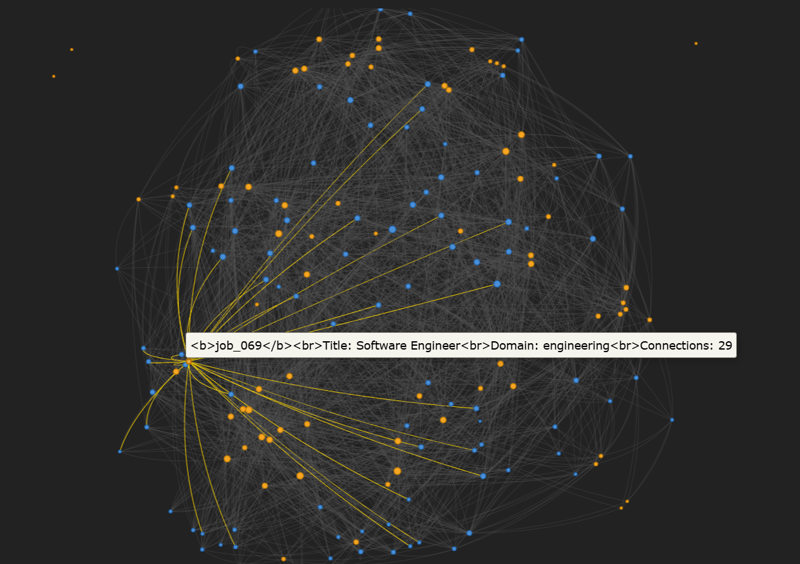
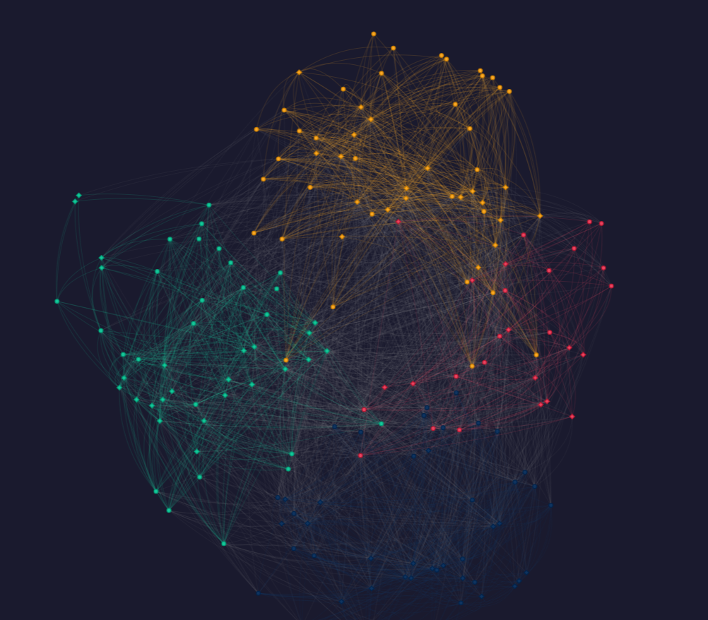
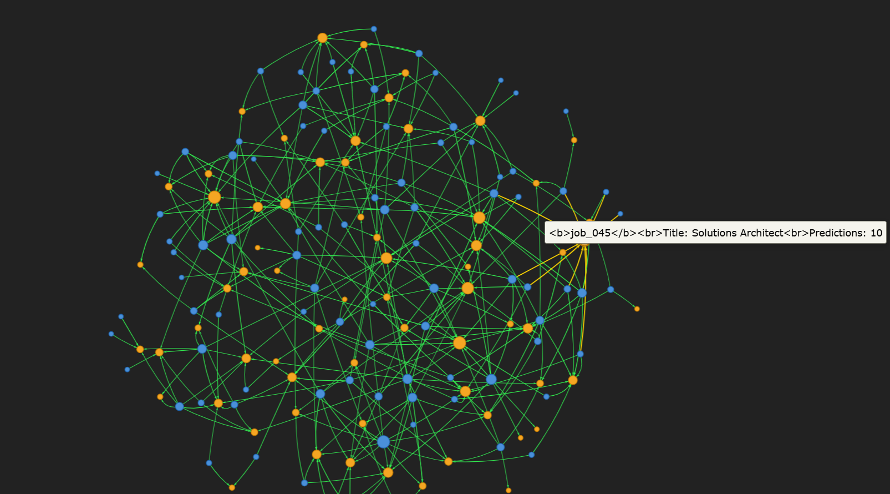
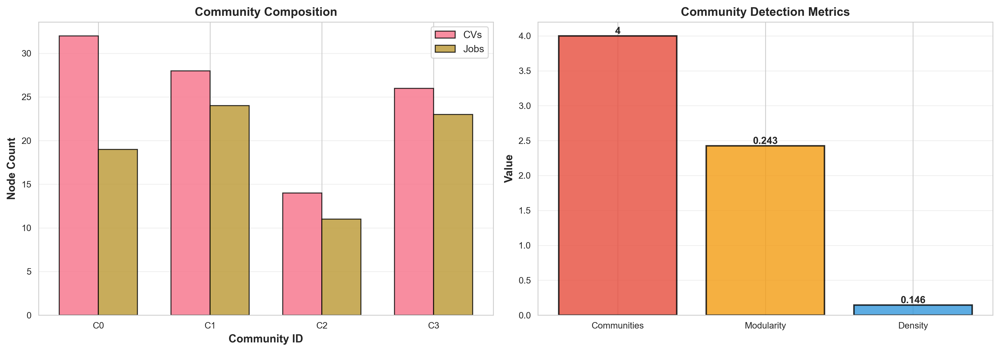
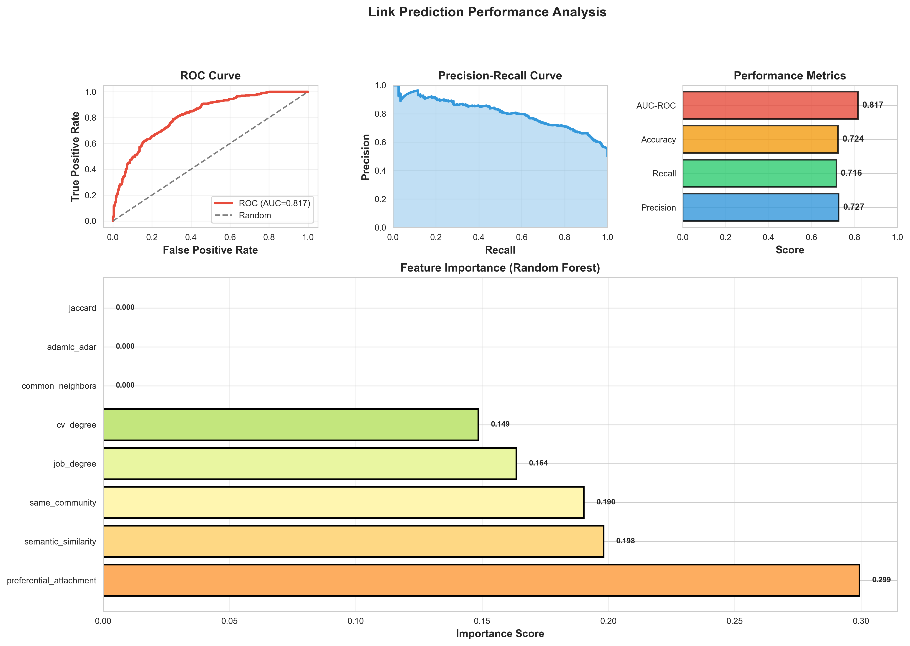
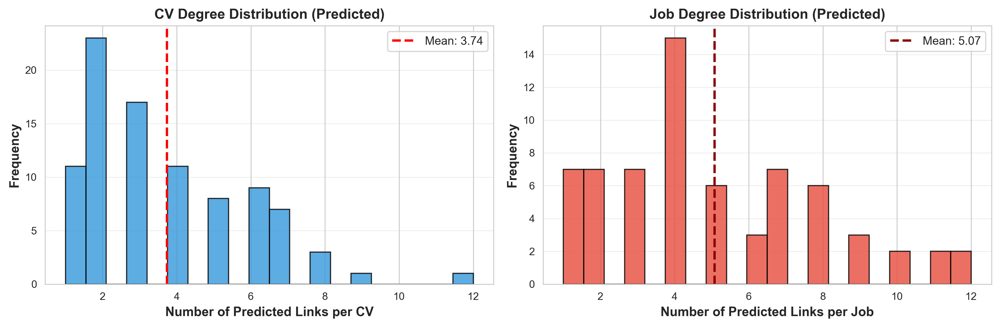
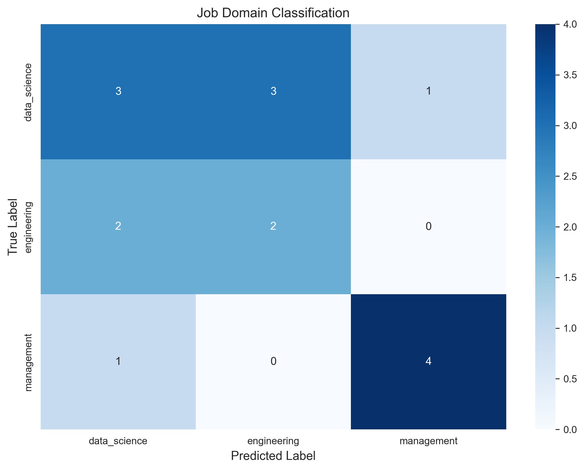
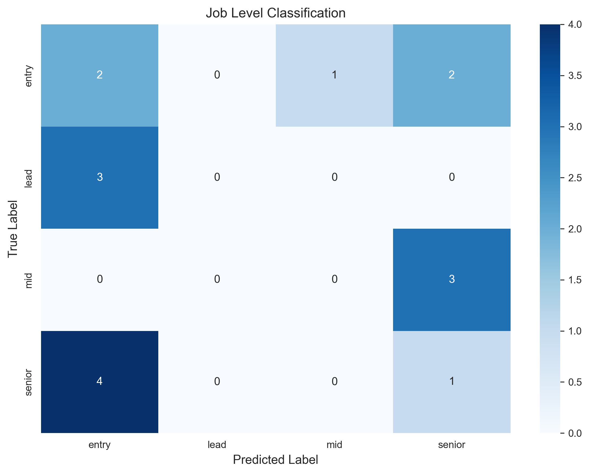
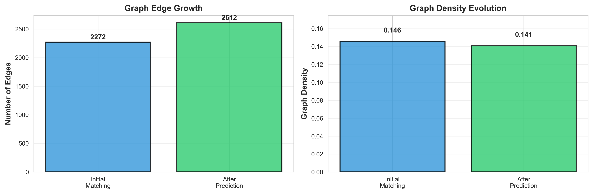
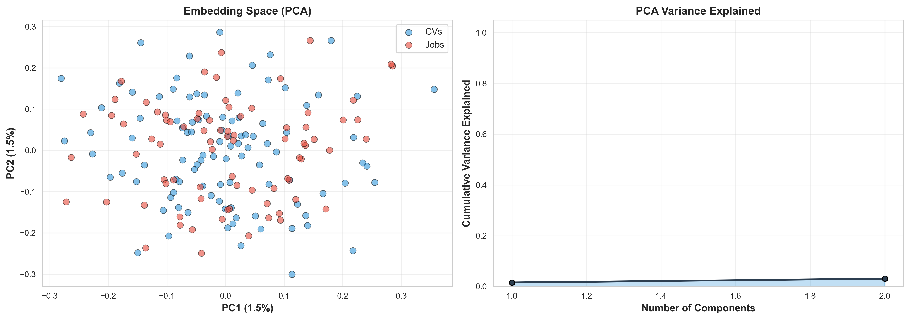

#  CV-Job Graph Mining

> **Intelligent CV-Job Matching using Graph Mining, Community Detection, and LLM-powered Semantic Analysis**

[](https://www.python.org/downloads/)
[](https://networkx.org/)
[](https://opensource.org/licenses/MIT)

---

##  Table of Contents

1. [Introduction](#-introduction)
2. [Problem Statement](#-problem-statement)
3. [Solution Approach](#-solution-approach)
4. [Key Results](#-key-results)
5. [Pipeline Architecture](#-pipeline-architecture)
6. [Graph Visualizations](#-graph-visualizations)
7. [Methodology Deep Dive](#-methodology-deep-dive)
8. [Installation & Usage](#-installation--usage)
9. [Project Structure](#-project-structure)
10. [Technologies](#-technologies-used)
11. [Contributors](#-contributors)

---

##  Introduction

**CV-Job Graph Mining** is an end-to-end machine learning pipeline that treats the job matching problem as a **graph mining task**. Instead of traditional keyword matching or simple similarity scores, we model the entire CV-Job ecosystem as a **bipartite network** where:

- **Nodes** represent either CVs (candidates) or Jobs (positions)
- **Edges** represent compatibility relationships based on skills, experience, and domain expertise
- **Communities** emerge naturally, revealing hidden talent pools and job clusters

This approach enables us to leverage powerful graph algorithms for **link prediction** (finding new matches), **community detection** (discovering talent clusters), and **classification** (categorizing jobs by domain/level).

---

##  Problem Statement

### The Challenge

Traditional job matching systems face several limitations:

| Problem | Description |
|---------|-------------|
| **Keyword Dependency** | Simple keyword matching misses semantic relationships ("Python" vs "Py" vs "Python3") |
| **Cold Start** | New jobs/CVs have no interaction history for collaborative filtering |
| **Siloed Analysis** | Each CV-Job pair is evaluated independently, ignoring network effects |
| **Scalability** | Pairwise comparison of all CVs with all Jobs is O(n×m) |

### Our Goal

Build a system that can:
1. **Discover hidden matches** between CVs and Jobs that aren't obvious from keywords alone
2. **Group similar profiles** into meaningful talent communities
3. **Predict new connections** with high confidence
4. **Classify jobs** automatically by domain and seniority level

---

##  Solution Approach

We solve this problem using a **6-phase pipeline**:

```
Phase 1: Data Loading        → Load 100 CVs + 77 Jobs from JSON
Phase 2: Embedding Generation → Convert text to 384-dim vectors using Sentence-BERT
Phase 3: Graph Construction   → Build bipartite graph with similarity-based edges
Phase 4: Community Detection  → Apply Louvain algorithm to find clusters
Phase 5: Link Prediction      → Train ML model to predict new CV-Job matches
Phase 6: Job Classification   → Classify jobs by domain and seniority level
```

### Why Graph-Based?

| Approach | Pros | Cons |
|----------|------|------|
| **Keyword Matching** | Fast, simple | Misses semantics |
| **Embedding Similarity** | Captures meaning | No structural info |
| **Collaborative Filtering** | Leverages history | Cold start problem |
| **Graph Mining (Ours)** | Combines all above + discovers communities | More complex |

---

## Key Results

### Performance Summary

| Metric | Value | Description |
|--------|-------|-------------|
| **Total Nodes** | 177 | 100 CVs + 77 Jobs |
| **Graph Edges** | 2,612 | Skill-based connections |
| **Graph Density** | 16.77% | Well-connected network |
| **Communities** | 4 | Distinct talent clusters |
| **Modularity** | 0.277 | Strong community structure |
| **Link Prediction AUC** | 81.65% | High-quality predictions |
| **Prediction Accuracy** | 72.4% | Reliable matches |
| **New Matches Found** | 340 | Previously undiscovered links |
| **High Confidence (>80%)** | 230 | Strong recommendations |

### What This Means

- **81.65% AUC-ROC**: Our model correctly ranks true matches above false ones 81.65% of the time
- **340 new predictions**: We discovered 340 potential CV-Job matches that weren't in the original data
- **4 communities**: The job market naturally segments into 4 distinct talent pools

---

## Pipeline Architecture

```
┌─────────────────────────────────────────────────────────────────────────┐
│                     CV-JOB GRAPH MINING PIPELINE                        │
├─────────────────────────────────────────────────────────────────────────┤
│                                                                         │
│   ╔═══════════════╗         ╔═══════════════════╗                      │
│   ║   CVs (100)   ║────────▶║  Sentence-BERT    ║                      │
│   ║   - Skills    ║         ║  Embeddings       ║                      │
│   ║   - Domain    ║         ║  (384 dimensions) ║                      │
│   ║   - Experience║         ╚════════╤══════════╝                      │
│   ╚═══════════════╝                  │                                 │
│                                      ▼                                 │
│   ╔═══════════════╗         ╔═══════════════════╗                      │
│   ║   Jobs (77)   ║────────▶║  Cosine Similarity║                      │
│   ║   - Title     ║         ║  Matrix           ║                      │
│   ║   - Skills    ║         ║  (100 × 77)       ║                      │
│   ║   - Level     ║         ╚════════╤══════════╝                      │
│   ╚═══════════════╝                  │                                 │
│                                      ▼                                 │
│                          ╔═══════════════════════╗                     │
│                          ║   BIPARTITE GRAPH     ║                     │
│                          ║   177 nodes           ║                     │
│                          ║   2,612 edges         ║                     │
│                          ╚══════════╤════════════╝                     │
│                                     │                                  │
│            ┌────────────────────────┼────────────────────────┐         │
│            ▼                        ▼                        ▼         │
│   ╔════════════════╗     ╔════════════════════╗    ╔═════════════════╗ │
│   ║  COMMUNITY     ║     ║  LINK PREDICTION   ║    ║ JOB CLASSIFIER  ║ │
│   ║  DETECTION     ║     ║                    ║    ║                 ║ │
│   ║  (Louvain)     ║     ║  - Graph Features  ║    ║ - Domain        ║ │
│   ║                ║     ║  - Embeddings      ║    ║ - Level         ║ │
│   ║  4 clusters    ║     ║  - XGBoost         ║    ║ - Random Forest ║ │
│   ║  modularity:   ║     ║                    ║    ║                 ║ │
│   ║  0.277         ║     ║  340 new matches   ║    ║ Multi-class     ║ │
│   ╚════════════════╝     ╚════════════════════╝    ╚═════════════════╝ │
│                                                                         │
└─────────────────────────────────────────────────────────────────────────┘
```

---

##  Graph Visualizations

### 1. Bipartite Graph - The Complete Network

The **bipartite graph** shows all CVs (blue nodes) and Jobs (orange nodes) with edges representing skill compatibility:



**Key Observations:**
- Blue nodes (CVs) on one side, orange nodes (Jobs) on the other
- Edge density indicates strong interconnection between candidates and positions
- Hub nodes (highly connected) represent versatile candidates or broad job requirements

---

### 2. Community Detection - Talent Clusters

The **Louvain algorithm** discovers **4 natural communities** of related CVs and Jobs:



| Community | Color | Size | Interpretation |
|-----------|-------|------|----------------|
| **0** | 🔴 Red/Pink | 28 nodes | Data Science & Analytics cluster |
| **1** | 🔵 Dark Blue | 47 nodes | Software Engineering cluster |
| **2** | 🟢 Teal/Green | 49 nodes | DevOps & Cloud cluster |
| **3** | 🟡 Orange/Yellow | 53 nodes | Management & Business cluster |

**What the communities reveal:**
- Candidates naturally group with jobs in their expertise area
- Cross-community edges represent versatile profiles
- Community detection helps with **targeted recommendations**

---

### 3. Link Prediction - Discovering New Matches

Our model predicts **340 new CV-Job matches** with varying confidence levels:



**How to interpret:**
- **Green edges**: New predicted links (not in original graph)
- **Edge thickness**: Prediction confidence (thicker = higher probability)
- **High-confidence predictions (>80%)**: 230 links ready for recruiter review

---

### 4. Community Structure Analysis

Detailed view of community modularity and inter-community connections:



---

### 5. Link Prediction Model Performance

ROC curve and performance metrics for our hybrid prediction model:



**Model Performance Breakdown:**

| Metric | Value | What it means |
|--------|-------|---------------|
| **AUC-ROC** | 81.65% | Model ranks true matches above false ones 81.65% of the time |
| **Precision** | 72.7% | Of predicted matches, 72.7% are correct |
| **Recall** | 71.6% | We find 71.6% of all true matches |
| **Accuracy** | 72.4% | Overall correct classification rate |

---

### 6. Prediction Confidence Distribution

Distribution of confidence scores across all 340 predictions:



**Interpretation:**
- Peak at high confidence (0.8-0.9) indicates reliable predictions
- Bimodal distribution suggests clear separation between good and poor matches
- 230 predictions exceed 80% confidence threshold

---

### 7. Job Classification Performance

Confusion matrices for domain and level classification:





---

### 8. Graph Evolution Through Pipeline

How the graph grows and enriches through each phase:



---

### 9. Embedding Space Visualization

t-SNE projection of CV and Job embeddings in 2D space:



**What this shows:**
- Similar CVs/Jobs cluster together in embedding space
- Clear separation between different domains
- Overlap regions indicate cross-functional opportunities

---

## 🔬 Methodology Deep Dive

### Phase 1: Data Representation

**CVs** contain:
```json
{
  "cv_id": "CV_001",
  "skills": ["Python", "Machine Learning", "SQL", "TensorFlow"],
  "domain": "Data Science",
  "seniority_level": "Mid",
  "years_experience": 4
}
```

**Jobs** contain:
```json
{
  "job_id": "job_001",
  "title": "Senior Data Scientist",
  "required_skills": ["Python", "ML", "Deep Learning"],
  "domain": "Data Science",
  "level": "Senior"
}
```

### Phase 2: Semantic Embeddings

We use **Sentence-BERT** (`all-MiniLM-L6-v2`) to convert text to dense vectors:

```python
# Skills → Single string → 384-dimensional vector
cv_text = "Python Machine Learning SQL TensorFlow Data Science Mid"
embedding = model.encode(cv_text)  # Shape: (384,)
```

**Why embeddings?**
- Capture semantic similarity ("ML" ≈ "Machine Learning")
- Enable mathematical operations (cosine similarity)
- Compact representation of complex profiles

### Phase 3: Graph Construction

We build a **bipartite graph** using NetworkX:

```python
G = nx.Graph()

# Add nodes
for cv in cvs:
    G.add_node(cv['cv_id'], type='cv', **cv)
for job in jobs:
    G.add_node(job['job_id'], type='job', **job)

# Add edges based on similarity threshold
for cv in cvs:
    for job in jobs:
        similarity = cosine_similarity(cv_embedding, job_embedding)
        if similarity > threshold:
            G.add_edge(cv['cv_id'], job['job_id'], weight=similarity)
```

### Phase 4: Community Detection (Louvain)

The **Louvain algorithm** optimizes modularity:

$$Q = \frac{1}{2m} \sum_{ij} \left[ A_{ij} - \frac{k_i k_j}{2m} \right] \delta(c_i, c_j)$$

Where:
- $A_{ij}$ = adjacency matrix
- $k_i$ = degree of node $i$
- $m$ = total edges
- $\delta(c_i, c_j)$ = 1 if nodes $i,j$ in same community

**Our result:** Modularity = 0.277 (indicates meaningful community structure)

### Phase 5: Link Prediction

Our **hybrid model** combines multiple feature types:

| Feature Type | Examples | Purpose |
|--------------|----------|---------|
| **Graph-based** | Common neighbors, Jaccard coefficient, Adamic-Adar | Structural patterns |
| **Embedding-based** | Cosine similarity, Euclidean distance | Semantic similarity |
| **Node features** | Degree centrality, community membership | Node importance |

**Training process:**
1. Split existing edges into train/test (80/20)
2. Generate negative samples (non-edges)
3. Extract features for each pair
4. Train XGBoost classifier
5. Predict on all non-edges
6. Filter by confidence threshold

### Phase 6: Job Classification

Multi-class classification using graph-enriched features:

```python
features = [
    node_degree,           # How connected is this job?
    community_id,          # Which cluster does it belong to?
    avg_neighbor_degree,   # Quality of connected CVs
    embedding_features,    # Semantic representation
    skill_count,           # Complexity indicator
]
```

---

##  Installation & Usage

### Prerequisites

- Python 3.10 or higher
- 8GB RAM recommended
- pip or conda package manager

### Step-by-Step Installation

```bash
# 1. Clone the repository
git clone https://github.com/chihebguesmi11/CV-Job-Graph-Mining.git
cd CV-Job-Graph-Mining

# 2. Create virtual environment (recommended)
python -m venv venv
source venv/bin/activate  # On Windows: venv\Scripts\activate

# 3. Install dependencies
pip install -r requirements.txt

# 4. Verify installation
python -c "import networkx; import torch; print('Ready!')"
```

### Running the Pipeline

```bash
# Execute the complete pipeline
python src/pipeline_executor.py
```

**Expected output:**
```
======================================================================
PHASE 1: LOADING DATA
======================================================================
✓ Loaded 100 CVs
✓ Loaded 77 jobs
✓ Loaded graph: 177 nodes, 2612 edges

======================================================================
PHASE 2: COMMUNITY DETECTION
======================================================================
✓ Detected 4 communities
✓ Modularity: 0.277

... (continues through all phases)

======================================================================
PIPELINE COMPLETE
======================================================================
✓ All visualizations saved to results/
```

### Output Files

After running, you'll find:

| Directory | Contents |
|-----------|----------|
| `results/figures/` | PNG visualizations (11 images) |
| `results/interactive/` | HTML interactive graphs (4 files) |
| `results/metrics/` | Performance metrics (JSON, CSV) |
| `models/` | Trained model artifacts |

---

##  Project Structure

```
CV-Job-Graph-Mining/
│
├── 📂 data/                          # Input data
│   ├── cvs.json                      # 100 candidate CVs
│   ├── jobs.json                     # 77 job postings  
│   ├── cv_job_graph.pkl              # Base bipartite graph
│   └── cv_job_graph_enriched.pkl     # Graph with predicted links
│
├── 📂 src/                           # Source code
│   ├── pipeline_executor.py          # Main orchestrator (runs everything)
│   ├── graph_builder.py              # Graph construction utilities
│   ├── link_predictor.py             # Link prediction model
│   ├── job_classifier.py             # Job domain/level classifier
│   ├── cv_community.py               # Community detection
│   ├── llm_utils.py                  # LLM & embedding utilities
│   ├── interactive_visualizer.py     # PyVis HTML graphs
│   ├── pipeline_visualizations.py    # Matplotlib visualizations
│   └── visualizer.py                 # Static chart generation
│
├── 📂 results/                       # Output artifacts
│   ├── figures/                      # PNG visualizations
│   │   ├── bipartie_graph.png        # Complete network
│   │   ├── community_graph.png       # Community clusters
│   │   ├── prediction_graph.png      # Predicted links
│   │   └── ... (8 more figures)
│   ├── interactive/                  # HTML dashboards
│   │   ├── bipartite_graph.html      # Interactive network
│   │   ├── communities_graph.html    # Interactive communities
│   │   ├── predicted_links.html      # Interactive predictions
│   │   └── dashboard.html            # Analytics dashboard
│   └── metrics/                      # Performance data
│       ├── link_prediction_performance.json
│       ├── predicted_links.csv
│       └── cv_skill_communities.csv
│
├── 📂 models/                        # Trained models
│   └── link_predictor.pkl            # Saved XGBoost model
│
├── 📂 notebooks/                     # Jupyter notebooks
├── 📂 tests/                         # Unit tests
├── 📂 config/                        # Configuration files
├── 📂 docs/                          # Documentation
│
├── requirements.txt                  # Python dependencies
├── README.md                         # This file
└── work_division_plan.md             # Team task allocation
```

---

##  Technologies Used

| Category | Technology | Purpose |
|----------|------------|---------|
| **Graph Analysis** | NetworkX | Graph construction, algorithms |
| **Community Detection** | python-louvain | Louvain modularity optimization |
| **Machine Learning** | scikit-learn | Classification, evaluation |
| **Gradient Boosting** | XGBoost | Link prediction model |
| **Embeddings** | sentence-transformers | Semantic text encoding |
| **LLM Integration** | Groq API | Advanced text processing |
| **Visualization** | matplotlib, seaborn | Static charts |
| **Interactive Viz** | PyVis | HTML network graphs |
| **Data Processing** | pandas, numpy | Data manipulation |

---

## Future Improvements

- [ ] **Real-time API**: REST endpoint for instant CV-Job matching
- [ ] **Graph Neural Networks**: Replace XGBoost with GCN/GAT for better predictions
- [ ] **Temporal Analysis**: Track how job market clusters evolve over time
- [ ] **External Integration**: Connect to LinkedIn/Indeed for live data
- [ ] **Explainable AI**: Generate human-readable explanations for matches
- [ ] **Active Learning**: Incorporate recruiter feedback to improve predictions

---

##  Contributors

| Name | Role | Responsibilities |
|------|------|------------------|
| **Chiheb Guesmi** | ML Engineer | Link prediction, job classification, pipeline integration |
| **Ramy** | Data Engineer | CV data generation, graph construction, embeddings |

---

##  License

This project is licensed under the MIT License - see the [LICENSE](LICENSE) file for details.

---

##  Acknowledgments

- **NetworkX** team for the powerful graph library
- **Hugging Face** for sentence-transformers
- **Groq** for LLM API access
- **Thomas Kipf** for GNN inspiration

---


