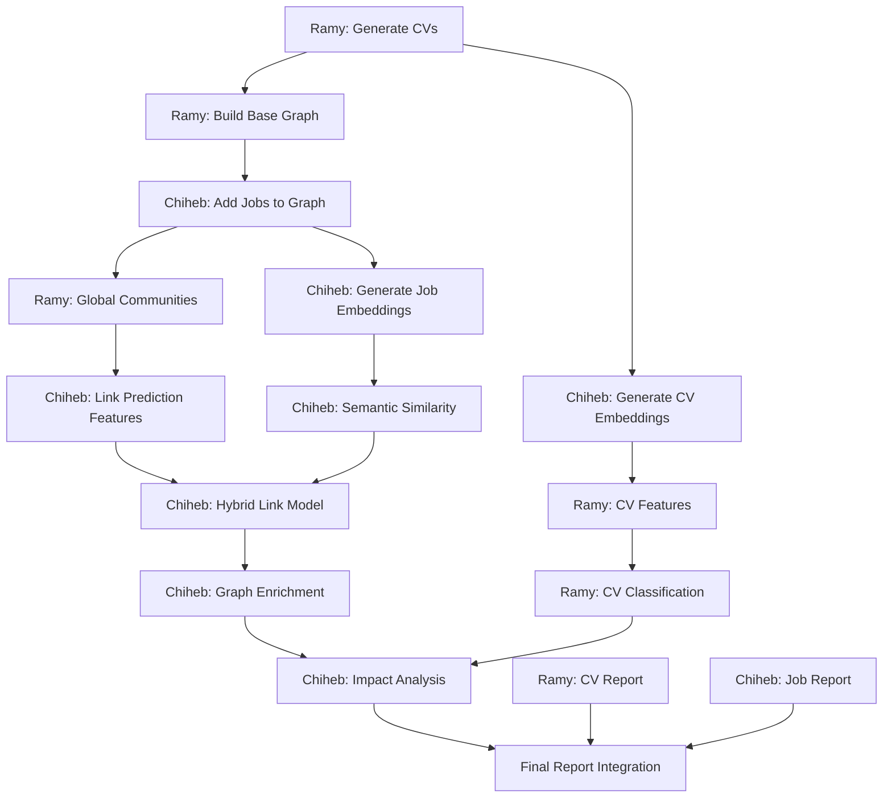

# CV-Job Graph Mining Project - Work Division Plan
## Team: Ramy & Chiheb

---

## 🎯 Division Strategy

**Principle**: Minimize dependencies by assigning complete vertical slices where possible, with clear handoff points.

**Ramy**: Data Pipeline + CV-Side Analysis (Nodes, Communities, Internal Graphs)  
**Chiheb**: Link Prediction + Job-Side Analysis (Classification, Enrichment, Validation)

---

## 👤 RAMY'S RESPONSIBILITIES

### **Phase 1: Data Generation & Infrastructure** (Priority: HIGHEST - Blocking)
**Deadline: Day 1-2**

#### Task 1.1: Synthetic Data Generation
- Generate 100 CVs with all attributes:
  - cv_id, skills (5-10), experience_years, education, seniority, domain, raw_text
- Create realistic CV text descriptions
- Generate skill co-occurrence data for internal graphs
- **Output**: `data/cvs.json` (JSON file with all CV data)
- **Handoff**: Share with Chiheb for embedding generation

#### Task 1.2: Initial Graph Construction
- Build bipartite graph structure with NetworkX
- Add CV nodes with all attributes
- Add 150-200 initial edges with weights [0.5, 1.0]
- Calculate and save initial graph statistics
- **Output**: 
  - `data/cv_job_graph.pkl` (NetworkX graph object)
  - `data/graph_statistics.json` (initial metrics)
- **Handoff**: Graph structure needed by Chiheb for Job node integration

#### Task 1.3: Internal CV Skill Graphs
- For each CV, create skill co-occurrence graph
- Nodes = skills, Edges = co-occurrence in same experience/project
- Store as CV attribute: `cv['internal_skill_graph']`
- **Output**: Updated `data/cvs.json` with skill graphs
- **Dependencies**: None (fully independent)

---

### **Phase 2: CV Community Analysis** (Priority: HIGH)
**Deadline: Day 3-4**

#### Task 2.1: CV Internal Community Detection
- Apply Louvain algorithm to each CV's skill graph
- Compute skill modularity and specialization scores
- Extract metrics:
  - `n_skill_communities`
  - `skill_modularity`
  - `specialization_score`
- **Output**: `results/metrics/cv_skill_communities.csv`
- **Dependencies**: Task 1.3 complete

#### Task 2.2: Global Community Detection (CV-focused)
- Run Louvain on bipartite graph (after Chiheb adds Job nodes)
- Compute modularity Q
- Analyze CV distribution across communities
- **Output**: 
  - `results/metrics/community_assignments.csv`
  - Community statistics for CVs
- **Dependencies**: Chiheb's Task 1.1 (Job nodes added)
- **Coordination Point**: Wait for Chiheb to add Jobs to graph

---

### **Phase 3: CV Node Analysis & Metrics** (Priority: MEDIUM)
**Deadline: Day 4-5**

#### Task 3.1: CV Structural Metrics
- Compute for all CV nodes:
  - Degree centrality
  - Betweenness centrality
  - PageRank
  - Clustering coefficient
- Create comprehensive metrics DataFrame
- **Output**: `results/metrics/cv_node_metrics.csv`
- **Dependencies**: Task 2.2 (needs full graph with Jobs)

#### Task 3.2: CV Visualizations
- Degree distribution histogram (CVs only)
- CV specialization score distribution
- Skill community size distribution
- Internal skill graph examples (top 3 CVs)
- **Output**: 
  - `results/figures/cv_degree_distribution.png`
  - `results/figures/cv_specialization_distribution.png`
  - `results/figures/skill_graph_examples.png`
- **Dependencies**: Tasks 2.1, 3.1

---

### **Phase 4: CV Node Classification** (Priority: MEDIUM)
**Deadline: Day 6-7**

#### Task 4.1: CV Feature Engineering
- Create comprehensive feature vectors for CVs:
  - Structural: degree, betweenness, PageRank, clustering
  - Community: community_id, community_size
  - Internal: n_skills, experience_years, n_skill_communities, specialization_score
  - Semantic: embeddings from Chiheb
- **Output**: `data/cv_feature_matrix.npy`, `data/cv_feature_names.json`
- **Dependencies**: Chiheb's Task 2.1 (CV embeddings)
- **Coordination Point**: Get embeddings from Chiheb

#### Task 4.2: Seniority Classification
- Train Random Forest for seniority prediction (junior/mid/senior)
- Use 80/20 train/test split
- Generate classification metrics and confusion matrix
- **Output**: 
  - `models/cv_seniority_classifier.pkl`
  - `results/figures/seniority_confusion_matrix.png`
  - `results/metrics/cv_seniority_metrics.json`
- **Dependencies**: Task 4.1

#### Task 4.3: Specialization Classification
- Binary classifier: specialist vs. polyvalent
- Based on skill modularity threshold (0.4)
- **Output**: 
  - `models/cv_specialization_classifier.pkl`
  - `results/metrics/cv_specialization_metrics.json`
- **Dependencies**: Task 4.1, Task 2.1

#### Task 4.4: Semi-Supervised Iterative Classification (REV2)
- Implement iterative classification algorithm
- Use 80% labeled, 20% unlabeled
- Run for max 10 iterations or until convergence
- **Output**: 
  - `results/metrics/semi_supervised_results.json`
  - Comparison with supervised approach
- **Dependencies**: Task 4.2

---

### **Phase 5: CV-Focused Analysis & Insights** (Priority: LOW)
**Deadline: Day 8**

#### Task 5.1: Atypical CV Detection
- Identify polyvalent profiles (specialization < 0.3)
- Identify bridge CVs (high betweenness)
- Analyze misclassified CVs
- **Output**: `results/analysis/atypical_cvs.json`
- **Dependencies**: Tasks 4.2, 4.3

#### Task 5.2: Specialization Coherence Analysis
- Correlation between CV specialization and community specialization
- Generate scatter plot
- **Output**: 
  - `results/figures/specialization_coherence.png`
  - `results/metrics/coherence_analysis.json`
- **Dependencies**: Tasks 2.1, 2.2

---

### **Phase 6: Integration & Final Report (CV Section)** (Priority: MEDIUM)
**Deadline: Day 9**

#### Task 6.1: CV Section of Report
- Write comprehensive CV analysis section:
  - CV statistics and distributions
  - Community detection results (CV perspective)
  - Classification performance
  - Atypical profile insights
- **Output**: `results/cv_analysis_report.md`
- **Dependencies**: All Ramy tasks complete

#### Task 6.2: Code Documentation & Testing
- Document all CV-related functions
- Create unit tests for data generation
- Create tests for CV feature engineering
- **Output**: 
  - `tests/test_cv_generation.py`
  - `tests/test_cv_features.py`
  - Updated docstrings in all modules

---

## 👤 CHIHEB'S RESPONSIBILITIES

### **Phase 1: Job Data & LLM Setup** (Priority: HIGHEST)
**Deadline: Day 1-2**

#### Task 1.1: Job Data Generation
- Generate 80 Jobs with all attributes:
  - job_id, required_skills (4-8), experience_required, level, domain, description
- Create realistic job descriptions
- Add Job nodes to Ramy's graph
- **Output**: 
  - `data/jobs.json`
  - Updated `data/cv_job_graph.pkl` (with Job nodes)
- **Dependencies**: Ramy's Task 1.2 (base graph structure)
- **Coordination Point**: Get graph from Ramy, add Jobs, return to shared location

#### Task 1.2: LLM Integration Setup
- Set up Groq API client
- Implement embedding generation using sentence-transformers
- Implement LLM-based similarity scoring function (Llama 3.1)
- Test API calls and error handling
- **Output**: 
  - `src/llm_utils.py` (embedding and scoring functions)
  - `config/llm_config.json`
- **Dependencies**: None (independent)

---

### **Phase 2: Embedding Generation** (Priority: HIGH - Blocking for Ramy)
**Deadline: Day 2-3**

#### Task 2.1: Generate CV & Job Embeddings
- Generate embeddings for all 100 CVs using sentence-transformers
- Generate embeddings for all 80 Jobs
- Save embeddings in efficient format
- **Output**: 
  - `data/cv_embeddings.npy`
  - `data/job_embeddings.npy`
  - `data/embedding_metadata.json`
- **Handoff**: Share embeddings with Ramy for CV classification
- **Dependencies**: Ramy's Task 1.1 (CV data), Chiheb's Task 1.1 (Job data)

#### Task 2.2: Semantic Similarity Matrix
- Compute cosine similarity between all CV-Job pairs
- Create similarity matrix
- **Output**: `data/semantic_similarity_matrix.npy`
- **Dependencies**: Task 2.1

---

### **Phase 3: Link Prediction** (Priority: HIGHEST - Core ML Task)
**Deadline: Day 4-6**

#### Task 3.1: Classical Link Prediction Features
- Implement graph-based similarity scores:
  - Common Neighbors (adapted for bipartite)
  - Adamic-Adar
  - Jaccard Coefficient
  - Preferential Attachment
- Compute for all CV-Job pairs
- **Output**: `data/graph_link_features.npy`
- **Dependencies**: Full graph (after Ramy's Task 2.2)

#### Task 3.2: Hybrid Link Prediction Model
- Create training dataset:
  - Positive samples: existing edges
  - Negative samples: non-edges (equal number)
- Feature vector: [CN, AA, JC, PA, same_community, cv_degree, job_degree, semantic_similarity]
- Train Random Forest classifier
- Evaluate: Precision, Recall, AUC-ROC
- **Target**: AUC > 0.75
- **Output**: 
  - `models/link_prediction_model.pkl`
  - `results/metrics/link_prediction_performance.json`
  - `results/figures/link_prediction_roc_curve.png`
- **Dependencies**: Tasks 2.2, 3.1, Ramy's Task 2.2 (communities)

#### Task 3.3: Link Prediction & Graph Enrichment
- Predict on all non-edges
- Filter predictions with threshold > 0.75
- Add predicted links to enriched graph
- Re-run community detection on enriched graph
- **Output**: 
  - `data/cv_job_graph_enriched.pkl`
  - `data/predicted_links.csv`
  - `results/metrics/enrichment_statistics.json`
- **Dependencies**: Task 3.2

#### Task 3.4: Feature Importance Analysis (Link Prediction)
- Analyze which features contribute most to predictions
- Generate feature importance plot
- **Output**: `results/figures/link_prediction_feature_importance.png`
- **Dependencies**: Task 3.2

---

### **Phase 4: Job Node Classification** (Priority: MEDIUM)
**Deadline: Day 6-7**

#### Task 4.1: Job Feature Engineering
- Create feature vectors for Jobs:
  - Structural: degree, betweenness, PageRank, clustering
  - Community: community_id, community_size
  - Semantic: job embeddings
  - Neighborhood: average neighbor features
- **Output**: `data/job_feature_matrix.npy`, `data/job_feature_names.json`
- **Dependencies**: Tasks 2.1, Ramy's Task 3.1 (for graph metrics computation pattern)

#### Task 4.2: Job Domain Classification
- Multi-class classifier for job domains (engineering/data_science/management)
- Train Random Forest
- Generate confusion matrix and metrics
- **Output**: 
  - `models/job_domain_classifier.pkl`
  - `results/figures/job_domain_confusion_matrix.png`
  - `results/metrics/job_domain_metrics.json`
- **Dependencies**: Task 4.1

#### Task 4.3: Job Level Classification
- Multi-class classifier for job levels (entry/mid/senior/lead)
- Train Random Forest
- Generate confusion matrix and metrics
- **Output**: 
  - `models/job_level_classifier.pkl`
  - `results/figures/job_level_confusion_matrix.png`
  - `results/metrics/job_level_metrics.json`
- **Dependencies**: Task 4.1

#### Task 4.4: Feature Importance Analysis (Job Classification)
- Generate feature importance plots for both classifiers
- **Output**: 
  - `results/figures/job_domain_feature_importance.png`
  - `results/figures/job_level_feature_importance.png`
- **Dependencies**: Tasks 4.2, 4.3

---

### **Phase 5: Impact Analysis & Validation** (Priority: HIGH)
**Deadline: Day 7-8**

#### Task 5.1: Graph Enrichment Impact Analysis
- Compare classification performance before/after graph enrichment
- Run CV classification on both graphs
- Run Job classification on both graphs
- Measure improvement
- **Output**: `results/analysis/enrichment_impact.json`
- **Dependencies**: Task 3.3, Ramy's Tasks 4.2-4.3
- **Coordination Point**: Use Ramy's CV classifiers on enriched graph

#### Task 5.2: Cross-Validation & Robustness Testing
- K-fold cross-validation for all classifiers
- Test different thresholds for link prediction
- Sensitivity analysis
- **Output**: `results/metrics/cross_validation_results.json`
- **Dependencies**: All classification tasks complete

---

### **Phase 6: Visualization & Final Report** (Priority: MEDIUM)
**Deadline: Day 8-9**

#### Task 6.1: Main Graph Visualizations
- Bipartite graph layout with community colors
- Community detection visualization
- Enriched graph comparison
- **Output**: 
  - `results/figures/bipartite_graph.png`
  - `results/figures/communities.png`
  - `results/figures/graph_enrichment_comparison.png`
- **Dependencies**: Tasks 3.3, Ramy's Task 2.2

#### Task 6.2: Job & Link Prediction Section of Report
- Write comprehensive sections on:
  - LLM integration and embeddings
  - Link prediction methodology and results
  - Job classification results
  - Graph enrichment impact
- **Output**: `results/link_job_analysis_report.md`
- **Dependencies**: All Chiheb tasks complete

#### Task 6.3: Final Integration Report
- Combine reports from both team members
- Generate executive summary
- Create comprehensive final report
- **Output**: `results/FINAL_REPORT.md`
- **Dependencies**: Ramy's Task 6.1, Chiheb's Task 6.2
- **Coordination Point**: Final integration with Ramy

---

## 🔄 COORDINATION POINTS & HANDOFFS

### Critical Path Dependencies



### Handoff Schedule

| Day | Handoff | From | To | Artifact |
|-----|---------|------|-----|----------|
| 1 | End of Day | Ramy | Chiheb | `data/cvs.json` + `data/cv_job_graph.pkl` |
| 2 | End of Day | Chiheb | Ramy | Updated `data/cv_job_graph.pkl` (with Jobs) |
| 3 | End of Day | Chiheb | Ramy | `data/cv_embeddings.npy` |
| 4 | Mid-Day | Ramy | Chiheb | `results/metrics/community_assignments.csv` |
| 7 | End of Day | Ramy | Chiheb | CV classification models for impact analysis |
| 8 | End of Day | Chiheb | Ramy | `data/cv_job_graph_enriched.pkl` |
| 9 | Mid-Day | Both | Both | Individual report sections |
| 9 | End of Day | Chiheb | Final | `results/FINAL_REPORT.md` |

---

## 📁 SHARED DELIVERABLES OWNERSHIP

### Ramy Owns:
```
data/
  cvs.json
  cv_embeddings.npy (generated by Chiheb, consumed by Ramy)
  cv_feature_matrix.npy
  cv_skill_communities.csv
  
models/
  cv_seniority_classifier.pkl
  cv_specialization_classifier.pkl
  
results/
  figures/cv_*.png
  metrics/cv_*.csv
  analysis/atypical_cvs.json
  cv_analysis_report.md
```

### Chiheb Owns:
```
data/
  jobs.json
  job_embeddings.npy
  semantic_similarity_matrix.npy
  graph_link_features.npy
  cv_job_graph_enriched.pkl
  predicted_links.csv
  job_feature_matrix.npy
  
models/
  link_prediction_model.pkl
  job_domain_classifier.pkl
  job_level_classifier.pkl
  
results/
  figures/job_*.png
  figures/link_prediction_*.png
  figures/bipartite_graph.png
  figures/communities.png
  metrics/job_*.json
  metrics/link_prediction_*.json
  analysis/enrichment_impact.json
  link_job_analysis_report.md
  FINAL_REPORT.md
```

### Shared (Both Contribute):
```
data/
  cv_job_graph.pkl (Ramy creates, Chiheb updates)
  graph_statistics.json (Ramy initial, Chiheb enriched)
  
results/
  metrics/
    node_metrics.csv (combined from both)
    community_assignments.csv (Ramy generates, both use)
```

---

## ⚠️ CONFLICT AVOIDANCE RULES

### 1. File Access Protocol
- **Ramy**: Works in `src/cv_*.py` files
- **Chiheb**: Works in `src/job_*.py` and `src/link_*.py` files
- **Shared**: `src/graph_builder.py` (coordinate via comments/branches)

### 2. Graph Modification Protocol
- **Rule**: Only ONE person modifies the graph at a time
- **Sequence**:
  1. Ramy creates base graph + CV nodes (Day 1)
  2. Ramy commits and notifies Chiheb
  3. Chiheb loads, adds Job nodes, saves (Day 2)
  4. Chiheb commits and notifies Ramy
  5. Both use read-only after Day 2 until enrichment
  6. Chiheb creates enriched graph (Day 7-8)

### 3. Data Generation Protocol
- **Ramy**: Generates ALL CV data (no Jobs)
- **Chiheb**: Generates ALL Job data (no CVs)
- **Never**: Generate data for the other person's domain

### 4. Embedding Protocol
- **Chiheb**: Generates ALL embeddings (CV + Job)
- **Ramy**: Only consumes embeddings (read-only)

### 5. Classification Protocol
- **Ramy**: ALL CV node classification
- **Chiheb**: ALL Job node classification + Link prediction
- **No Overlap**

### 6. Reporting Protocol
- Each writes their own section independently
- Chiheb does final integration (owns final report)
- Both review but only Chiheb commits final version

### 7. Communication Protocol
- **Daily Standup**: 10 AM - Share progress, blockers, handoffs
- **Slack Channel**: `#cv-job-graph-project`
- **Handoff Notifications**: Tag partner when artifact is ready
- **Blocker Escalation**: If blocked > 4 hours, escalate to project manager

---

## 🎯 SUCCESS METRICS BY PERSON

### Ramy's Metrics:
- ✅ 100 CVs generated with complete attributes
- ✅ All CVs have internal skill graphs
- ✅ CV specialization scores computed
- ✅ CV seniority classification accuracy > 0.70
- ✅ Semi-supervised classification implemented and tested
- ✅ Atypical profile analysis completed
- ✅ CV report section delivered on time

### Chiheb's Metrics:
- ✅ 80 Jobs generated with complete attributes
- ✅ All embeddings (CV + Job) generated successfully
- ✅ Link prediction AUC > 0.75
- ✅ Job domain classification accuracy > 0.70
- ✅ Job level classification accuracy > 0.70
- ✅ Graph enrichment adds 20+ predicted links
- ✅ Impact analysis shows improvement > 0.05
- ✅ Final integrated report delivered

---

## 📅 DETAILED TIMELINE

### Week 1: Foundation & Core Development

**Day 1: Data Generation Sprint**
- **Morning**: 
  - Ramy: Generate CVs + skill graphs
  - Chiheb: Setup LLM utils + API testing
- **Afternoon**: 
  - Ramy: Build base graph, add CV nodes
  - Chiheb: Generate Jobs
- **End of Day**: Ramy hands off graph + CVs to Chiheb

**Day 2: Graph & Embedding Setup**
- **Morning**: 
  - Ramy: Start internal CV community detection
  - Chiheb: Add Jobs to graph, return to Ramy
- **Afternoon**: 
  - Ramy: Continue skill graph analysis
  - Chiheb: Generate all embeddings
- **End of Day**: Chiheb hands off embeddings to Ramy

**Day 3: Community & Similarity Analysis**
- **Morning**: 
  - Ramy: Global community detection (uses Chiheb's graph)
  - Chiheb: Compute semantic similarity matrix
- **Afternoon**: 
  - Ramy: CV node metrics computation
  - Chiheb: Start classical link prediction features
- **End of Day**: Both complete community/similarity foundations

**Day 4: Feature Engineering Sprint**
- **Morning**: 
  - Ramy: CV feature engineering (uses Chiheb's embeddings)
  - Chiheb: Complete link prediction features
- **Afternoon**: 
  - Both: Feature matrix creation
  - Ramy hands off community data to Chiheb
- **Evening**: Both ready for ML training

**Day 5: Classification Training**
- **Morning**: 
  - Ramy: Train CV seniority classifier
  - Chiheb: Train hybrid link prediction model
- **Afternoon**: 
  - Ramy: Train specialization classifier
  - Chiheb: Evaluate link prediction, tune threshold
- **Evening**: Both run initial evaluations

**Day 6: Advanced Classification & Enrichment**
- **Morning**: 
  - Ramy: Semi-supervised classification (REV2)
  - Chiheb: Job feature engineering
- **Afternoon**: 
  - Ramy: Analyze results, start visualizations
  - Chiheb: Train Job domain & level classifiers
- **Evening**: Core ML tasks complete

**Day 7: Graph Enrichment & Impact Analysis**
- **Morning**: 
  - Ramy: CV analysis & atypical detection
  - Chiheb: Predict links & create enriched graph
- **Afternoon**: 
  - Ramy: Specialization coherence analysis
  - Chiheb: Impact analysis (uses Ramy's classifiers)
- **End of Day**: Ramy hands off CV models to Chiheb

**Day 8: Visualization & Analysis Sprint**
- **Morning**: 
  - Ramy: Generate all CV visualizations
  - Chiheb: Generate graph & Job visualizations
- **Afternoon**: 
  - Ramy: Start CV report section
  - Chiheb: Cross-validation & robustness testing
- **Evening**: Analysis complete

**Day 9: Final Integration & Delivery**
- **Morning**: 
  - Ramy: Finalize CV report section
  - Chiheb: Write Job/Link prediction sections
- **Afternoon**: 
  - Chiheb: Integrate final report
  - Both: Review and finalize
- **Evening**: Final delivery and presentation prep

---

## 🛠️ RECOMMENDED TOOLS & PRACTICES

### Version Control Strategy
```bash
# Main branch: stable code only
# Ramy's branch: ramy/cv-development
# Chiheb's branch: chiheb/job-link-development

# Ramy workflow
git checkout -b ramy/cv-development
# ... work on CV tasks
git add src/cv_*.py data/cvs.json
git commit -m "feat: CV generation and skill graphs"
git push origin ramy/cv-development

# Chiheb workflow
git checkout -b chiheb/job-link-development
# ... work on Job/Link tasks
git add src/job_*.py src/link_*.py data/jobs.json
git commit -m "feat: Job generation and LLM setup"
git push origin chiheb/job-link-development

# Handoffs: merge to main only after testing
```

### Code Organization
```python
# Ramy's modules
src/
  cv_generator.py         # CV data generation
  cv_graph_builder.py     # Internal skill graphs
  cv_community.py         # CV community detection
  cv_classifier.py        # CV classification models
  cv_analyzer.py          # Atypical profiles, coherence

# Chiheb's modules
src/
  job_generator.py        # Job data generation
  llm_utils.py            # LLM/embedding utilities
  link_predictor.py       # Link prediction models
  job_classifier.py       # Job classification models
  graph_enrichment.py     # Graph enrichment logic
  impact_analyzer.py      # Enrichment impact analysis

# Shared (coordinate carefully)
src/
  graph_builder.py        # Base graph construction
  metrics_computer.py     # Centrality, community metrics
  visualizer.py           # Common visualization utils
```

### Testing Strategy
- **Ramy**: Unit tests for CV generation, skill graphs, CV features
- **Chiheb**: Unit tests for Job generation, embeddings, link prediction
- **Integration Tests**: Run together after handoffs

### Documentation Standard
```python
def example_function(param1, param2):
    """
    Brief description of function.
    
    Args:
        param1 (type): Description
        param2 (type): Description
    
    Returns:
        type: Description
    
    Owner: Ramy/Chiheb
    Dependencies: List any dependencies
    """
    pass
```

---

## 📊 PROGRESS TRACKING

### Daily Checklist Template

**Ramy's Daily Report**:
```
Date: [DATE]
Tasks Completed:
- [ ] Task description
- [ ] Task description

Tasks In Progress:
- [ ] Task description

Blockers:
- None / [Description]

Handoffs Needed:
- None / [What + When]

Next Day Plan:
- [ ] Task description
```

**Chiheb's Daily Report**:
```
Date: [DATE]
Tasks Completed:
- [ ] Task description
- [ ] Task description

Tasks In Progress:
- [ ] Task description

Blockers:
- None / [Description]

Handoffs Needed:
- None / [What + When]

Next Day Plan:
- [ ] Task description
```

---

## 🚨 RISK MITIGATION

### Potential Conflicts & Solutions

| Risk | Probability | Impact | Mitigation |
|------|-------------|---------|------------|
| Graph file corruption during handoff | Medium | High | Use git for version control, checksums |
| Embedding generation delays Ramy | Medium | Medium | Chiheb generates embeddings early (Day 2) |
| Community detection results differ | Low | Medium | Use same random seed (42) everywhere |
| Link prediction threshold dispute | Low | Low | Document decision rationale |
| Report integration conflicts | Medium | Medium | Chiheb owns final integration, clear sections |
| API rate limiting (Groq) | Medium | Medium | Use local sentence-transformers as backup |
| Data format incompatibility | Medium | High | Define JSON schemas upfront, validate early |

### Escalation Protocol
1. **Technical Issue**: Try to resolve together (30 min)
2. **Still Blocked**: Document and escalate to project manager
3. **Critical Blocker**: Emergency standup within 2 hours

---

## ✅ FINAL DELIVERABLE CHECKLIST

### Ramy's Final Deliverables:
- [ ] `data/cvs.json` (100 CVs with all attributes)
- [ ] `data/cv_job_graph.pkl` (initial version)
- [ ] `data/cv_feature_matrix.npy`
- [ ] `models/cv_seniority_classifier.pkl`
- [ ] `models/cv_specialization_classifier.pkl`
- [ ] All CV visualizations (5 figures)
- [ ] `results/metrics/cv_skill_communities.csv`
- [ ] `results/metrics/cv_node_metrics.csv`
- [ ] `results/analysis/atypical_cvs.json`
- [ ] `results/cv_analysis_report.md`
- [ ] `tests/test_cv_*.py`
- [ ] Documentation for all CV modules

### Chiheb's Final Deliverables:
- [ ] `data/jobs.json` (80 Jobs with all attributes)
- [ ] `data/cv_embeddings.npy` + `data/job_embeddings.npy`
- [ ] `data/semantic_similarity_matrix.npy`
- [ ] `data/cv_job_graph_enriched.pkl`
- [ ] `data/predicted_links.csv`
- [ ] `models/link_prediction_model.pkl`
- [ ] `models/job_domain_classifier.pkl`
- [ ] `models/job_level_classifier.pkl`
- [ ] All Job/Link visualizations (8 figures)
- [ ] `results/metrics/link_prediction_performance.json`
- [ ] `results/analysis/enrichment_impact.json`
- [ ] `results/link_job_analysis_report.md`
- [ ] `results/FINAL_REPORT.md`
- [ ] `tests/test_job_*.py` + `tests/test_link_*.py`
- [ ] Documentation for all Job/Link modules

### Shared Quality Checks:
- [ ] All code follows PEP 8 style guide
- [ ] All functions have docstrings
- [ ] All metrics meet target thresholds
- [ ] All visualizations are publication-quality (300 DPI)
- [ ] All file paths use relative references
- [ ] Git history is clean and well-documented
- [ ] README.md is comprehensive
- [ ] requirements.txt is complete and tested

---

## 💡 PRO TIPS

### For Ramy:
1. **Generate diverse CVs**: Mix skill levels, domains, experience to create interesting patterns
2. **Skill graphs**: Use realistic co-occurrence (e.g., Python + ML in data science projects)
3. **Specialization**: Create both specialist and generalist profiles deliberately
4. **Early validation**: Test graph structure immediately after creation
5. **Feature engineering**: Document feature creation rationale for report

### For Chiheb:
1. **LLM integration**: Have fallback (sentence-transformers) ready for API issues
2. **Threshold tuning**: Test multiple thresholds (0.7, 0.75, 0.8) for link prediction
3. **Batch processing**: Generate embeddings in batches to avoid memory issues
4. **Cross-validation**: Use stratified splits to handle class imbalance
5. **Impact analysis**: Clearly show before/after comparisons with visualizations

### For Both:
1. **Communicate early and often**: Don't wait until you're blocked
2. **Version everything**: Data, models, graphs - all should be versioned
3. **Document assumptions**: Write down why you made certain design choices
4. **Test incrementally**: Don't wait until the end to test integration
5. **Think about presentation**: Results should tell a story, not just show metrics

---

## 📞 CONTACT & COORDINATION

**Project Manager**: [Your Name]  
**Slack Channel**: #cv-job-graph-project  
**Daily Standup**: 10:00 AM (15 min max)  
**Weekly Sync**: Friday 3:00 PM (1 hour)

**Emergency Contact Protocol**:
- Critical blocker: @mention in Slack immediately
- Need urgent file: Use shared Google Drive for large files
- Git conflicts: Schedule immediate pairing session

---

## 🎓 LEARNING OBJECTIVES

### Ramy Will Learn:
- Internal graph construction within nodes
- Community detection at multiple scales
- Semi-supervised iterative classification
- Specialization analysis through structural metrics

### Chiheb Will Learn:
- LLM integration for graph tasks
- Hybrid ML models combining structural + semantic features
- Link prediction methodology
- Graph enrichment and impact measurement

### Both Will Learn:
- Large-scale graph mining project management
- Collaborative data science workflows
- Integration of traditional graph algorithms with modern ML
- Effective technical communication and handoffs

---

**END OF WORK DIVISION PLAN**

**Remember**: Clear communication, clean handoffs, and mutual respect for each other's expertise will make this project successful. When in doubt, over-communicate!

Good luck, Ramy and Chiheb! 🚀
